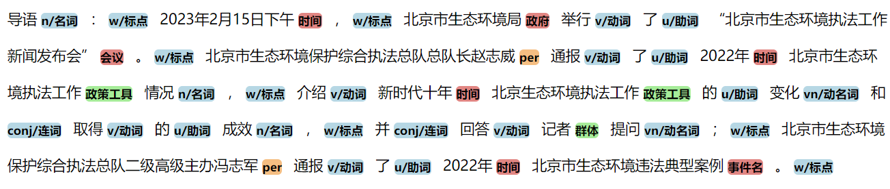
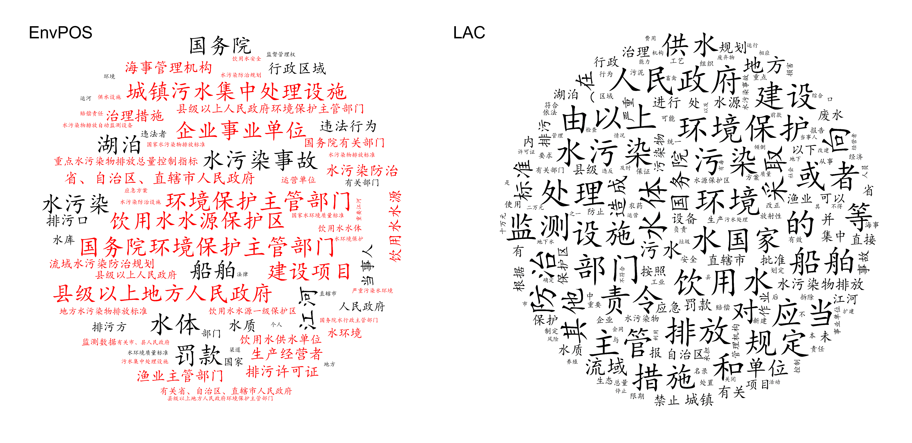

### 环境领域词法分析工具


本工具对环境领域文本设计41类标注，其中词性标注14类，实体标注14类，术语标注12类。

| 词性 | n        | vn     | r    | v    | d    | a      | p    | f      | q    | m    | conj | u    | xc       | w    | ord |
| ---- | -------- | ------ | ---- | ---- | ---- | ------ | ---- | ------ | ---- | ---- | ---- | ---- | -------- | ---- | ---- |
|      | 普通名词 | 动名词 | 代词 | 动词 | 副词 | 形容词 | 介词 | 方位词 | 量词 | 数词 | 连词 | 助词 | 其他虚词 | 标点 | 序数词 |
|      |          |        |      |      |      |        |      |        |      |      |      |      |          |      |       |

| 实体 | time | loc  | per  | com    | org  | gov  | doc      | event | pro                            | ins             | means           | meet   | code | c              |
| ---- | ---- | ---- | ---- | ------ | ---- | ---- | -------- | ----- | ------------------------------ | --------------- | --------------- | ------ | ---- | -------------- |
|      | 时间 | 地点 | 人名 | 公司名 | 组织 | 政府 | 文件名称 | 事件  | 工程/<br />项目/<br />环境设施 | 设备/<br />工具 | 方法/<br />工艺 | 会议名 | 编码 | 其他<br />专名 |
|      |      |      |      |        |      |      |          |       |                                |                 |                 |        |      |                |

| 术语 | med            | phe            | pol    | microbe | plant | animal | desease | hy   | group | act            | policy         | b    | env                |
| ---- | -------------- | -------------- | ------ | ------- | ----- | ------ | ------- | ---- | ----- | -------------- | -------------- | ---- | ------------------ |
|      | 环境<br />介质 | 环境<br />现象 | 污染物 | 微生物  | 植物  | 动物   | 疾病    | 行业 | 群体  | 政策<br />行动 | 政策<br />工具 | 属性 | 其他<br />环境术语 |
|      |                |                |        |         |       |        |         |      |       |                |                |      |                    |


gitee上有镜像项目：
[envpos](https://gitee.com/bihuaibin/envpos)

- TODO 
- [x] 上传项目
- [] 打包至pypi库
- [] 上传标注文档在wiki里


## 准确率报告
### 1. 总体准确率
使用$F_1$作为评价指标

| 模型 | $F_1$ | 
| ---- | ---- |
| envBert | 91.7 |
| envBert-large | 91.0 |
| envAlbert | 85.2 |
| Bert | 89.4 |
| Bert-large | 89.8 |
envBert-Large不如Bert，可能是数据集比较小，大模型容易过拟合，且envBert-large预训练的时间不如envBert长。


## 使用方式 QuickStart

先安装torch和transformers,datasets，
torch需要根据gpu和cuda版本选择合适的版本，如果不熟悉这些，可以先尝试用cpu版本的。
```bash
pip install torch
pip install transformers datasets
```
transformers的依赖比较多，如果出现`import error`，大概率是transformers的依赖没有装上，pip install 装上即可


再安装envpos
```
git clone https://gitee.com/bihuaibin/envpos
cd envpos && python setup.py install && cd ..
```


进行推理：
```python
import envpos
s = '''
（一）重点行业绿色升级工程。以钢铁、有色金属、建材、石化化工等行业为重点，推进节能改造和污染物深度治理。推广高效精馏系统、高温高压干熄焦、富氧强化熔炼等节能技术，鼓励将高炉—转炉长流程炼钢转型为电炉短流程炼钢。
'''
envpos.cut(s)
```

可视化
```python
envpos.viz(s)
```


切换bert模型


详细的使用方式见`使用示例.ipynb`


## 一些例子

识别结果截图：




和LAC制作词云对比，envpos可以识别出长词，不会将长词切分为散串



与DDparser结合进行句法分析：


## liscence

Apache 2.0


